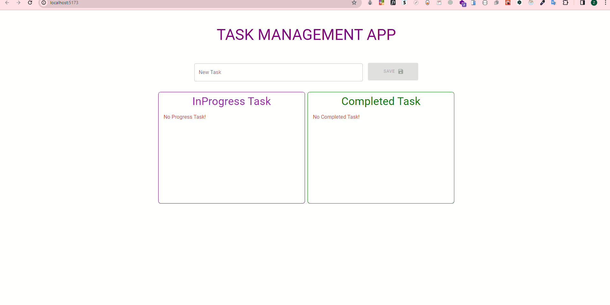

## Task Managament App

This project was created using react, vite and typescript, and includes adding, deleting, and categorizing tasks as completed or inprogres.Rtk Query was used in data exchange management.

## Project Live Page
[TaskManagement Live Page]()

## Project Outcome

## Tech/Framework used

**_React.js_** : Created the project using the JavaScript framework React.React is a JavaScript library used for creating user interfaces. react-dom is used to  
**_Reduxjs/toolkit_** : Redux Toolkit is a library that enables faster and more efficient use of Redux. It simplifies global state management using Redux.  
**_React-redux_**: React Redux is a library that facilitates the integration of React and Redux. It is used for global state management in React  
**_Axios_**:It used for managing API requests and CRUD operations. 
**_RTK Query_**: RTK Query is part of Redux Toolkit and is a library used for data fetching. It simplifies interaction with APIs and facilitates data exchange. RTK Query comes with features provided by Redux Toolkit, simplifying data management. 
***_Material-UI_***: Material-UI is a library used for creating user interfaces in React applications. It provides components and styles that adhere to the principles of Material Design. 
***TypeScript***: TypeScript is a programming language based on JavaScript, used to provide type safety, better IDE support, and improved code understanding in JavaScript projects.

## API Reference

https://65b384d3770d43aba479ec91.mockapi.io/